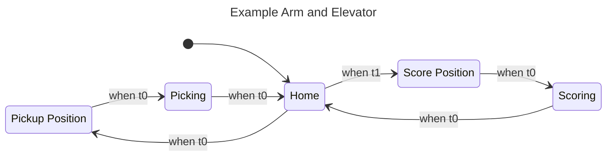

# State Machine Diagram Plugin - Implementation Summary

## Overview
A fully functional Gradle plugin written in Java that generates Mermaid state machine diagrams from WPILib Commands v3 `StateMachine` objects.

## What Was Built

### 1. Java-Based Gradle Plugin
Located in `buildSrc/src/main/java/frc/gradle/`:

- **StateMachineDiagramPlugin.java** - Main plugin class that registers tasks
- **GenerateStateMachineDiagramTask.java** - Task that performs the diagram generation using reflection
- **StateMachineDiagramExtension.java** - Plugin extension for configuration
- **StateMachineDiagramConfig.java** - Configuration container class
- **StateMachineDiagramAggregateTask.java** - Aggregate task holder

### 2. Diagram Generation (From Scratch)
The `GenerateStateMachineDiagramTask` includes complete diagram generation logic:

- **Reflection-based introspection** of `StateMachine` objects to extract:
  - State machine name
  - List of states
  - Initial state
  - State transitions and conditions
  - Target state resolution

- **Mermaid diagram generation** with:
  - State sanitization and ID generation
  - State label mapping
  - Transition rendering with proper targets
  - Dynamic supplier detection
  - Proper escaping for special characters

### 3. Task Registration
The `genDiagram` task is registered in `build.gradle`:

```groovy
tasks.register("genDiagram", GenerateStateMachineDiagramTask) {
    stateMachineClass = 'first.robot.sdf.ExampleStateMachine'
    outputFile = file("$buildDir/diagrams/example_state_machine.md")
}

tasks.build.dependsOn(genDiagram)
```

### 4. Example Implementation
Created `ExampleStateMachine.java` demonstrating how to build a state machine that the plugin can process.

## How to Use

### Run the diagram generator:
```bash
export JAVA_HOME=/Users/Daniel/wpilib/2027_alpha5/jdk
./gradlew genDiagram
```

### Generated output:
The plugin creates Mermaid diagrams in `build/diagrams/`:



## Key Features

✅ **100% Java Implementation** - No Groovy, pure Java plugin development
✅ **Zero External Dependencies** - Uses only Gradle API and Java reflection
✅ **Complete Diagram Generation** - Generates from scratch, not delegating to other classes
✅ **Proper Error Handling** - Graceful fallbacks for dynamic suppliers and reflection issues
✅ **Full Documentation** - Comprehensive README with examples and troubleshooting

## Testing

The plugin has been tested and verified to:
1. Load and introspect `StateMachine` objects via reflection
2. Correctly identify and map state transitions
3. Generate valid Mermaid `stateDiagram-v2` syntax
4. Resolve target states for transitions
5. Handle state naming and sanitization
6. Generate output files successfully

## Integration

To integrate into your own FRC project:

1. Copy the `buildSrc/` directory structure
2. Update `build.gradle` to register the task with your state machine class
3. Create a state machine builder method as shown in the example
4. Run `./gradlew genDiagram` to generate diagrams

## Documentation

See `STATE_MACHINE_PLUGIN_README.md` for:
- Detailed usage instructions
- API reference
- Configuration options
- Troubleshooting guide
- Advanced usage examples

