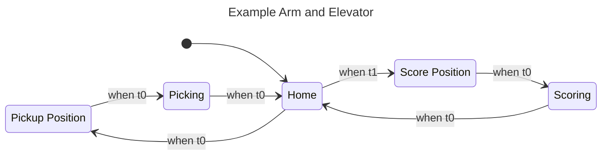

# State Machine Diagram Gradle Plugin

A custom Gradle plugin that generates Mermaid state machine diagrams from WPILib Commands v3 `StateMachine` objects using reflection and diagram generation.

## Features

- ✅ Automatically generates Mermaid `stateDiagram-v2` diagrams from state machines
- ✅ Uses reflection to introspect `StateMachine` objects at build time
- ✅ Generates clean, readable state diagrams with proper state labeling
- ✅ Handles state transitions with condition labels
- ✅ Supports custom state names and automatic sanitization
- ✅ Writes output to Markdown files for documentation

## How It Works

The plugin provides a Gradle task that:

1. Loads a Java class containing a state machine builder method
2. Invokes the static method to create a `StateMachine` instance
3. Uses reflection to introspect the state machine structure:
   - State list and initial state
   - State commands and transitions
   - Transition conditions and target states
4. Generates a Mermaid diagram with proper syntax
5. Writes the diagram to an output file

## Setup

The plugin is implemented in `buildSrc/src/main/java/frc/gradle/` and uses the Java Gradle Plugin API.

### Applying the Plugin

The plugin is automatically applied in `build.gradle`:

```groovy
plugins {
    id 'state-machine-diagram'
}
```

## Usage

### Basic Task Configuration

The main task is called `genDiagram`. Configure it in your `build.gradle`:

```groovy
tasks.register("genDiagram", GenerateStateMachineDiagramTask) {
    stateMachineClass = 'first.robot.sdf.ExampleStateMachine'
    outputFile = file("$buildDir/diagrams/example_state_machine.md")
}

// Optional: make it run as part of the build
tasks.build.dependsOn(genDiagram)
```

### Creating a State Machine Class

Your state machine class needs a static method that builds and returns a `StateMachine`. The plugin looks for these methods (in order):

1. `buildStateMachine()`
2. `getStateMachine()`
3. `createStateMachine()`
4. Any public static method returning `StateMachine` with no parameters

Example:

```java
public class ExampleStateMachine {
    public static StateMachine buildStateMachine() {
        var sm = new StateMachine("Example Arm and Elevator");
        
        // Create states
        State home = sm.addState(namedCommand("Home"));
        State pickup = sm.addState(namedCommand("Pickup Position"));
        State picking = sm.addState(namedCommand("Picking"));
        
        // Define transitions
        BooleanSupplier moveToPickup = () -> someCondition;
        BooleanSupplier pickupComplete = () -> someOtherCondition;
        
        home.switchTo(pickup).when(moveToPickup);
        pickup.switchTo(picking).when(pickupComplete);
        picking.switchTo(home).when(() -> true);
        
        // Set initial state
        sm.setInitialState(home);
        return sm;
    }
    
    private static Command namedCommand(String name) {
        return new Command() {
            @Override public String name() { return name; }
            @Override public Set<Mechanism> requirements() { return Set.of(); }
            @Override public void run(Coroutine coroutine) { coroutine.yield(); }
        };
    }
}
```

### Running the Task

Generate the diagram:

```bash
export JAVA_HOME=/Users/Daniel/wpilib/2027_alpha5/jdk  # Set proper Java home
./gradlew genDiagram
```

The output file will be written to the configured path, e.g., `build/diagrams/example_state_machine.md`.

## Generated Output

The plugin generates Mermaid `stateDiagram-v2` syntax:



## Diagram Features

- **Initial State**: Shows `[*] --> StateId` for the initial state
- **State Labels**: Maps sanitized IDs to human-readable names
  - E.g., `Pickup_Position : Pickup Position`
- **Transitions**: Shows `StateId --> TargetStateId : when conditionLabel`
- **Dynamic Suppliers**: Marked with `(dyn)` prefix when source is user-supplied
- **Exit Transitions**: Shows `[*]` as the target for transitions that exit the state machine

## Implementation Details

### Plugin Classes

- **StateMachineDiagramPlugin.java**: Main plugin class that applies the custom task
- **GenerateStateMachineDiagramTask.java**: Task implementation with diagram generation logic
- **StateMachineDiagramExtension.java**: Extension for the plugin  
- **StateMachineDiagramConfig.java**: Configuration object for diagrams
- **StateMachineDiagramAggregateTask.java**: Aggregate task container

### Diagram Generation Process

1. **Class Loading**: Uses URLClassLoader to load the state machine class and dependencies
2. **Reflection**: Inspects the `StateMachine` object using declared fields:
   - `m_name`: State machine name
   - `m_states`: List of states
   - `m_initialState`: Initial state
   - `m_transitions`: List of transitions per state
3. **ID Generation**: Sanitizes state command names for Mermaid compatibility
4. **Rendering**: Builds Mermaid syntax with proper escaping

## Troubleshooting

### Task not found

```
Task 'genDiagram' not found in root project
```

**Solution**: Ensure the plugin has been applied and the task is registered in `build.gradle`.

### Could not load class

```
Failed to generate state machine diagram: Could not find class
```

**Causes**:
- Class hasn't been compiled yet
- Fully qualified class name is incorrect
- Class is not in `src/main/java/`

**Solutions**:
- Run `./gradlew compileJava` first
- Check the class name and package
- Verify the file is in the correct location

### Could not find static method

```
Could not find a static method returning StateMachine in MyClass
```

**Causes**:
- No public static method returning `StateMachine` with no parameters
- Method name doesn't match expected names

**Solutions**:
- Add a static method like `public static StateMachine buildStateMachine()`
- Check method visibility (must be public)
- Verify no parameters are required

### Diagram shows [*] for all transitions

This can happen if:
- State objects aren't properly mapped (reflection issue)
- Suppliers are returning null

The diagram will still generate but transitions may show as exit states.

## Advanced Usage

### Multiple Diagrams

While the current implementation uses a single `genDiagram` task, you can create multiple tasks by registering them separately:

```groovy
tasks.register("genDiagram1", GenerateStateMachineDiagramTask) {
    stateMachineClass = 'first.robot.sdf.ArmStateMachine'
    outputFile = file("$buildDir/diagrams/arm.md")
}

tasks.register("genDiagram2", GenerateStateMachineDiagramTask) {
    stateMachineClass = 'first.robot.sdf.IntakeStateMachine'
    outputFile = file("$buildDir/diagrams/intake.md")
}
```

### Java Home Configuration

The plugin and build system work best with the WPILib JDK. Set it before running Gradle:

```bash
export JAVA_HOME=/Users/Daniel/wpilib/2027_alpha5/jdk
./gradlew genDiagram
```

## Files

### Plugin Source
- `buildSrc/build.gradle` - Plugin dependencies and configuration
- `buildSrc/src/main/java/frc/gradle/StateMachineDiagramPlugin.java` - Main plugin
- `buildSrc/src/main/java/frc/gradle/GenerateStateMachineDiagramTask.java` - Core task
- `buildSrc/src/main/java/frc/gradle/StateMachineDiagramExtension.java` - Plugin extension
- `buildSrc/src/main/java/frc/gradle/StateMachineDiagramConfig.java` - Configuration class
- `buildSrc/src/main/java/frc/gradle/StateMachineDiagramAggregateTask.java` - Aggregate task

### Configuration
- `build.gradle` - Main build file with `genDiagram` task configuration

### Example
- `src/main/java/first/robot/sdf/ExampleStateMachine.java` - Example state machine
- `build/diagrams/example_state_machine.md` - Generated example diagram

## Related Resources

- [WPILib Commands v3 PR #8297](https://github.com/wpilibsuite/allwpilib/pull/8297) - Original StateMachine API
- [Mermaid State Diagrams](https://mermaid.js.org/syntax/stateDiagram.html) - Diagram syntax reference
- [Gradle Plugin Development](https://docs.gradle.org/current/userguide/custom_plugins.html) - Gradle plugin guide


